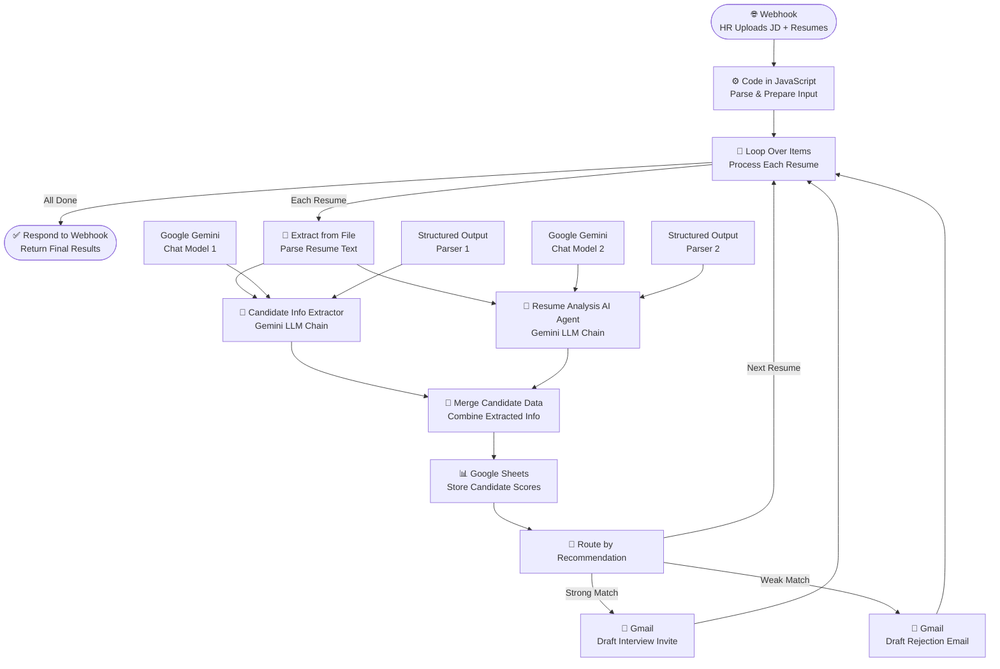

# 🍽️ Eat-Resume
### AI-Powered Resume Screening & Candidate Evaluation System
> Built during the Agentic AI Specialisation — Masai School × IIT Patna (Recruit-AI Hackathon, 2026)

---

## 🧩 The Problem
For every open corporate role, companies receive 250+ applications.
HR teams spend ~3 minutes per resume manually screening — that's **12.5 hours of wasted 
productivity per job posting.**

Legacy ATS tools rely on keyword matching and miss contextual experience.
eat-resume fixes this with AI that actually *reads* and *reasons.*

---

## ✅ The Solution
Upload a Job Description + bulk resumes → get a ranked candidate shortlist + 
auto-drafted emails in ~15 seconds per batch.

---

## 🏗️ Architecture
Two specialised Google Gemini agents run in parallel per resume:
- **Agent 1 — Info Extractor:** Pulls deterministic data (name, email, phone)
- **Agent 2 — Rubric Analyser:** Scores resume against JD, outputs strict 
  Interview / Hold / Reject verdict + reasoning

Results → Google Sheets (ranked shortlist) → Gmail API (auto-drafted emails)

---

## ⚙️ Tech Stack
| Layer | Tool |
|---|---|
| Frontend | Lovable |
| Workflow Automation | n8n |
| AI Models | Google Gemini 2.5 Pro (dual LLM chains) |
| Storage | Google Sheets |
| Email Automation | Gmail API |

---

## 📊 Key Metrics (MVP)
- ⏱️ **~15 seconds** per batch vs 3 min/resume manually
- 🎯 **>98% pipeline success rate** target (end-to-end processing)
- 📈 Tracked: Time Savings per Hire, Human-AI Agreement Rate, 
  Hiring Manager Retention

---

## 🗺️ Roadmap
- **Phase 1 (MVP):** PDF ingestion, dual-agent scoring, Gmail automation ✅
- **Phase 2 (Months 1–3):** .docx/.txt support, dynamic rubric weighting, 
  rate-limit handling
- **Phase 3 (Months 4–6):** ATS integrations (Greenhouse, Lever), 
  Calendly scheduling, Bias Mitigation Dashboard

---

## 📁 Files in this Repo
| File | Description |
|---|---|
| `workflow.json` | n8n workflow — import directly into your n8n instance |
| `Problem_Framing.pdf` | Persona, problem statement & market research |
| `Metrics_Roadmap.pdf` | KPIs and 3-phase product roadmap |
| `Process_Decision_Log.pdf` | Prompt iterations, architecture decisions & learnings |

---

## 🔗 Live Demo
👉 [eat-resume.lovable.app](https://eat-resume.lovable.app)

--

## 🔄 Workflow Diagram

